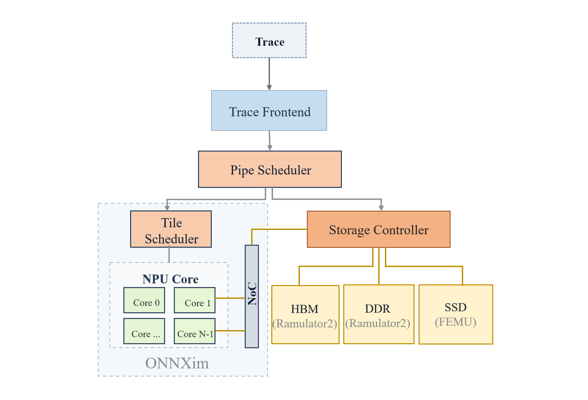

# GR\_simulator

[](https://github.com/PSAL-POSTECH/ONNXim/actions/workflows/docker-image.yml)

GR\_simulator是一个配备统一互联结构（Unified Bus, UB）的 HSTU-based GR 推理系统。系统以 NPU 作为主要计算设备，NPU 侧配备 HBM，用于承载在线推理过程中的当前执行数据和临时缓冲；片外由UB连接 DRAM 与 SSD ，统一协调不同存储层级中的冷/热用户数据进入 NPU 侧执行。

---

## 目录

- [系统架构](#系统架构)
- [代码结构](#代码结构)
- [环境配置](#环境配置)
- [编译运行](#编译运行)
- [实验复现方法](#实验复现方法)

---

## 系统架构



GR\_simulator 以 trace 作为主要输入，Trace Frontend 负责解析算子与访存描述，Pipe Scheduler 将计算与预取请求组织成流水执行。NPU 采用 [ONNXim](https://github.com/PSAL-POSTECH/ONNXim) 的 tile scheduler 与多核执行模型，存储侧由 Storage Controller 统一管理 HBM、DDR 和 SSD 请求，其中 HBM/DDR 使用 [Ramulator2](https://github.com/CMU-SAFARI/ramulator2) 建模，SSD 使用 [FEMU](https://github.com/MoatLab/FEMU) BlackBoxSSD 建模。NPU Core 通过 NoC 与多级存储连接。

---

## 代码结构

仿真器代码中的核心目录和文件如下：

```text
GR_simulator/
├── CMakeLists.txt              # C++ 仿真器构建入口
├── Dockerfile                  # Docker 运行环境
├── conanfile.txt               # C++ 依赖声明
├── configs/                    # 仿真器配置文件
│   ├── 910A.json
│   ├── 910B.json
│   ├── 910C.json
│   ├── booksim2_configs/       # Booksim2 NoC 配置
│   └── ramulator2_configs/     # Ramulator2 DDR/HBM 配置
├── src/                        # 仿真器核心源码
│   ├── main.cc                 # 程序入口
│   ├── Simulator.*             # 仿真主循环
│   ├── Core.* / Systolic*.cc   # NPU core 与 systolic array 建模
│   ├── Dram.* / Hbm.* / Ssd.*  # DDR、HBM、SSD 接口封装
│   ├── Interconnect.*          # NoC/互连建模
│   ├── frontend/trace/         # trace 解析
│   ├── memory/                 # storage controller建模
│   ├── operations/             # Gemm、Embedding、HSTUAttention 等算子模型
│   ├── scheduler/              # 算子/语言模型调度器
│   ├── models/                 # 语言模型 workload 支持
│   └── benchmark/              # 单项内存带宽 benchmark
├── scripts/                    # trace 生成、校准、实验运行和结果处理脚本
│   ├── run_hstu.sh             # HSTU 实验的通用入口
│   ├── generate_hstu_baseline_trace.py
│   ├── recompute_ratio_cost_model_new.py
│   ├── recompute_ratio_calibration.json
│   ├── run_ActionReuse.sh
│   ├── run_ItemRecompute.sh
│   ├── run_OoO_pipeline_Ablation.sh
│   ├── run_SpeedupComparison.sh
│   └── run_scalability.sh
├── docs/                       # 公式、流程与可复现性说明
├── introductions/              # 论文/报告用实验结果、表格和图
├── example/                    # models list 和 trace 示例
├── extern/                     # protobuf、Ramulator2 等第三方组件
└── img/                        # README 和文档图片资源
```

---

## 环境配置

### 1. Docker方式（推荐）

使用项目提供的Dockerfile构建镜像：

```bash
# 克隆仓库
git clone https://github.com/Lucyyannn/GR_simulator.git
cd GR_simulator
git submodule update --recursive --init

# 构建Docker镜像
docker build . -t gr-simulator
```

启动容器并挂载项目目录：

```bash
docker run -it --name gr-simulator-mini \
  -v $(pwd):/workspace/GR_simulator \
  -w /workspace/GR_simulator \
  onnxim bash

# 在容器内安装相关依赖并构建目标
(docker) mkdir -p build && cd build
(docker) conan install .. --build=missing
(docker) cmake ..
(docker) make -j$(nproc)
```

### 2. 手动安装方式

**系统要求：**

| 依赖项    | 最低版本             |
| --------- | -------------------- |
| 操作系统  | Ubuntu 20.04（推荐） |
| GCC / G++ | >= 10.5.0            |
| CMake     | >= 3.22.1            |
| Python    | >= 3.8               |
| Conan     | 1.57.0               |

**Conan依赖**：

| 包名               | 版本   |
| ------------------ | ------ |
| boost              | 1.79.0 |
| robin-hood-hashing | 3.11.5 |
| spdlog             | 1.11.0 |
| nlohmann\_json     | 3.11.2 |

### 3.环境验证

完成环境搭建后，可通过运行简单的算子来验证环境配置成功：

```bash
bash scripts/run_embedding.sh # 一个简单的embedding算子测试
bash scripts/run_gemm.sh      # 一个简单的gemm算子测试
```

运行脚本后，终端输出日志信息，并在最后报告各模块时钟周期数与仿真时间。

---

## 编译运行

### 1.编译

```bash
cd /path/to/GR_simulator
mkdir -p build && cd build
conan install .. 
cmake .. 
make -j$(nproc)
```

### 2.运行 HSTU 模型推理

仿真器使用`run_hstu.sh`脚本作为HSTU推理仿真的主入口，该脚本可执行一次完整的HSTU ranking模型推理，具体包含如下流程：

1. **trace生成**。根据命令行输入参数（如模型层数、请求数量、优化策略）生成相应的模型trace文件；
2. **使用指定的仿真器配置执行仿真**。仿真执行过程中，会生成三个关键文件：`layer.log`记录仿真器运行过程中的日志，并在最后报告仿真时间；`layer_breakdown.csv`记录每个 layer 的 preload、compute、op、movin 等事件的起止时间和耗时；`hardware_summary.csv`汇总NPU、HBM、DDR、SSD 的硬件利用率。
3. **绘制流水线可视化图像**。根据`layer_breakdown.csv`记录的各事件明细，绘制时间轴图像，可用于分析流水线中的compute与preload的调度效果。

一个简单的运行命令示例如下：

```bash
bash scripts/run_hstu.sh \
  --base-config configs/910C.json \
  --result-dir results/examples/hstu_minimal_no_opt \
  --log-level info
```

可通过指定更多参数调整负载配置。`run_hstu.sh`脚本的详细说明可见 `introductions/run_experiments.md`。

## 实验复现方法

本节介绍几个关键实验的复现脚本与使用方法。

### 1. 推理效率评估实验

```bash
bash scripts/run_SpeedupComparison.sh
```

该脚本在910C配置下进行各方法的推理效率对比，覆盖 `Recompute`、`FullCache`、`W_AR`、`W_IR`、`W_both` 五类方法，并遍历 HSTU-small/middle/large、`kv_len={4096,8192,16384}`、`batch_size={1,4,8}`、hot/cold 用户。对于开启Item Recompute优化的 W_IR 和 W_both方法，会自动调用 `recompute_ratio_cost_model_new.py`脚本，使用代价模型估算每个case的最优recompute比例。默认输出目录为 `results/SpeedupComparison`。

### 2. 不同 NPU 配置的扩展实验

```bash
bash scripts/run_scalability.sh \
  --result-root results/hstu_scalability_$(date +%Y%m%d_%H%M%S) \
  --max-concurrent 45 \
  --docker-container gr-simulator \
```

该脚本在`910A/910B/910C`三种代表性NPU配置下，分别对Cold/Hot用户测试`Full_Cache`、`Full_Recompute`、`w_AR`、`w_IR`、`w_both` 五类方法。脚本默认对单用户执行，历史序列长度`KV_LEN`=4096。由于不同硬件配置的参数特性不同，脚本会先执行内存带宽校准，然后根据代价模型估算最优recompute比例，并执行模型推理。

完成实验后，可运行 `scripts/plot_pipeline_comparison.py `脚本对统一配置下五种方法的流水线可视化，直观对比不同方法的性能差异。

### 3. M/M/1 P99 Latency 实验

```bash
bash scripts/run_main_task_mm1_p99.sh
```

该脚本用于基于主实验结果计算稳态 M/M/1 P99 latency。脚本会读取 `results/main_task` 下 HSTU-middle、`seq_len=16384`、`batch_size=1`、cold 用户场景中 `Recompute`、`FullCache`、`W_AR`、`W_IR`、`W_both` 五类方法的 `hardware_summary.csv`，并覆盖 `request_rate={16,32,48,64,80,96,114,128}`。运行前需要先生成或拷贝主实验结果到 `results/main_task`；默认输出为 `results/p99_mm1_HSTU_middle_seq16384_bs1_cold.csv` 和 `results/p99_mm1_HSTU_middle_seq16384_bs1_cold.png`。

### 4. Action Reuse 参数选择实验

```bash
bash scripts/run_ActionReuse.sh
```

该脚本用于复现 Action KV Reuse 方法的参数网格实验，测试不同窗口大小与`Top-K`取值下的端到端推理时延。脚本默认选择 HSTU-small、`kv_len=4096`、cold/SSD 场景，遍历 `window_size={64,128,256,512}` 与 `top_k={1,2,3,4,5}`，并为每组参数设置对应的 `kv_reuse_ratio`，该值取自HSTU模型侧[recsys](https://github.com/cry-daniel/recsys)在各参数配置下测试得到的实际复用率。默认输出目录为 `results/ActionReuse`。

### 5. Item Re-computation 方法有效性实验

```bash
bash scripts/run_ItemRecompute.sh
```

该脚本用于探究Item Re-computation 方法的embedding索引模式、不同recompute比例的影响。它会运行 `continuous` 与 `random` 两种历史 embedding 索引模式，覆盖 `0%/20%/40%/60%/80%/100%` 以及代价模型估算出的最优 recompute 比例，对比不同的Item Recompute设置的效果。默认输出目录为 `results/ItemRecompute`。

### 6. Out-of-Order Pipeline 消融实验

```bash
bash scripts/run_OoO_pipeline_Ablation.sh
```

该脚本用于复现 Out-of-Order pipeline 的消融实验，比较开启和关闭 out-of-order pipeline 时，action reuse 与 item recompute 组合后的表现。脚本默认遍历 `cold/hot`、`batch_size={1,4,8}`、`kv_len={4096,8192,16384}`，默认输出目录为 `results/OoO_pipeline_ablation`。
