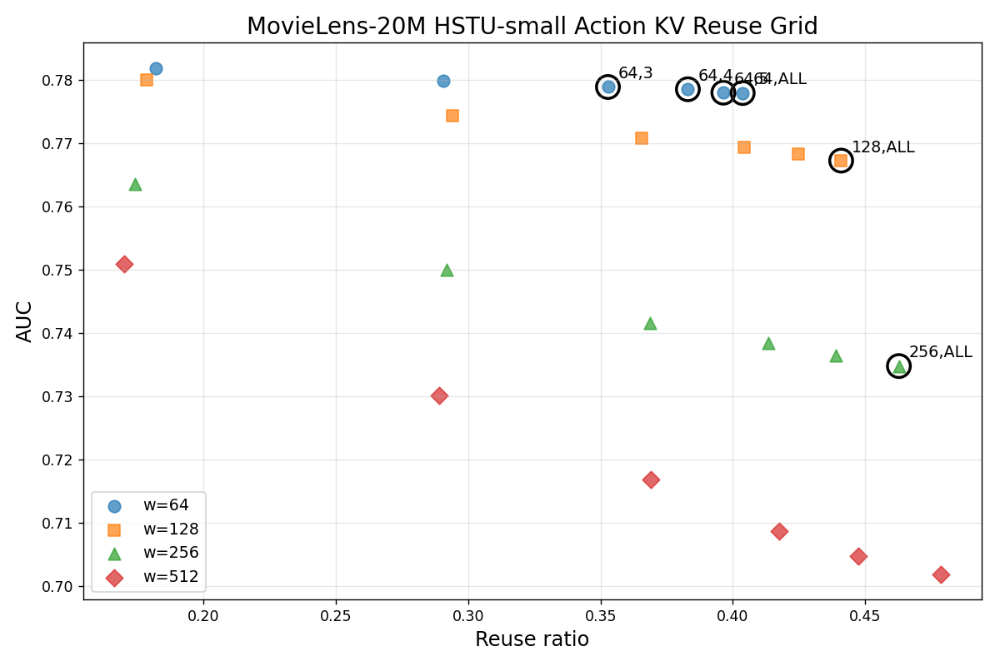
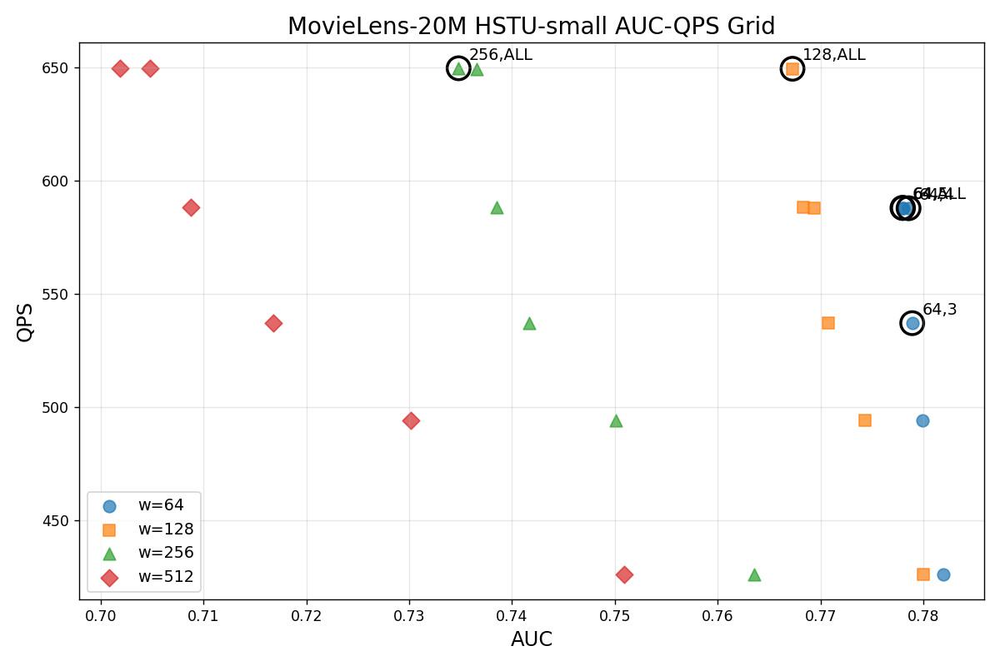

# summary
## 算法实验
| Dataset       | Model        | Action Reuse | AUC | NKV |
|----------------|-------------|---------------|-----|-----|
| KuaiRand-1k    | HSTU-small  | Off           | 0.759071 | 1.000000 |
|                |             | On            | 0.744496 | 0.516492 |
|                | HSTU-middle | Off           | 0.685225 | 1.000000 |
|                |             | On            | 0.680404 | 0.516492 |
|                | HSTU-large  | Off           | 0.625479 | 1.000000 |
|                |             | On            | 0.612859 | 0.516492 |
| MovieLens-20M  | HSTU-small  | Off           | 0.786133 | 1.000000 |
|                |             | On            | 0.776942 | 0.603561 |
|                | HSTU-middle | Off           | 0.782328 | 1.000000 |
|                |             | On            | 0.774358 | 0.603561 |
|                | HSTU-large  | Off           | 0.751251 | 1.000000 |
|                |             | On            | 0.751083 | 0.603960 |

## Detailed Analysis

HSTU-small ; `window_size={64,128,256,512}` and `top_k={1,2,3,4,5,ALL}`. AUC is `task0.AUC`.

### Pareto Frontier

| window_size | top_k | AUC | Reuse Ratio | NKV | AUC Diff | simulation time (ms) | qps |
|---:|---:|---:|---:|---:|---:|---:|---:|
| 256 | ALL | 0.734803 | 46.27% | 0.537255 | -0.050169 | 1.539490 | 649.566 |
| 128 | ALL | 0.767269 | 44.09% | 0.559073 | -0.017703 | 1.540010 | 649.346 |
| 64 | ALL | 0.777956 | 40.37% | 0.596332 | -0.007015 | 1.700830 | 587.948 |
| 64 | 5 | 0.778013 | 39.64% | 0.603597 | -0.006958 | 1.700990 | 587.893 |
| 64 | 4 | 0.778551 | 38.30% | 0.617021 | -0.006421 | 1.701310 | 587.782 |
| 64 | 3 | 0.778907 | 35.28% | 0.647206 | -0.006065 | 1.862000 | 537.057 |

### Recommended Points

(128,ALL)

### Full Grid

| window_size | top_k | baseline AUC | AUC | AUC Diff | Reuse Ratio | NKV | Pareto | simulation time (ms) | qps |
|---:|---:|---:|---:|---:|---:|---:|---|---:|---:|
| 64 | 1 | 0.784972 | 0.781921 | -0.003051 | 18.19% | 0.818088 | no | 2.345790 | 426.296 |
| 64 | 2 | 0.784972 | 0.779868 | -0.005104 | 29.05% | 0.709469 | no | 2.023370 | 494.225 |
| 64 | 3 | 0.784972 | 0.778907 | -0.006065 | 35.28% | 0.647206 | yes | 1.862000 | 537.057 |
| 64 | 4 | 0.784972 | 0.778551 | -0.006421 | 38.30% | 0.617021 | yes | 1.701310 | 587.782 |
| 64 | 5 | 0.784972 | 0.778013 | -0.006958 | 39.64% | 0.603597 | yes | 1.700990 | 587.893 |
| 64 | ALL | 0.784972 | 0.777956 | -0.007015 | 40.37% | 0.596332 | yes | 1.700830 | 587.948 |
| 128 | 1 | 0.784972 | 0.780002 | -0.004969 | 17.87% | 0.821337 | no | 2.345880 | 426.279 |
| 128 | 2 | 0.784972 | 0.774305 | -0.010666 | 29.42% | 0.705819 | no | 2.023300 | 494.242 |
| 128 | 3 | 0.784972 | 0.770770 | -0.014202 | 36.55% | 0.634485 | no | 1.861680 | 537.149 |
| 128 | 4 | 0.784972 | 0.769346 | -0.015626 | 40.44% | 0.595565 | no | 1.700810 | 587.955 |
| 128 | 5 | 0.784972 | 0.768319 | -0.016653 | 42.48% | 0.575179 | no | 1.700390 | 588.100 |
| 128 | ALL | 0.784972 | 0.767269 | -0.017703 | 44.09% | 0.559073 | yes | 1.540010 | 649.346 |
| 256 | 1 | 0.784972 | 0.763532 | -0.021439 | 17.42% | 0.825809 | no | 2.345970 | 426.263 |
| 256 | 2 | 0.784972 | 0.750073 | -0.034899 | 29.19% | 0.708055 | no | 2.023340 | 494.232 |
| 256 | 3 | 0.784972 | 0.741643 | -0.043329 | 36.88% | 0.631207 | no | 1.861630 | 537.164 |
| 256 | 4 | 0.784972 | 0.738514 | -0.046458 | 41.35% | 0.586541 | no | 1.700610 | 588.024 |
| 256 | 5 | 0.784972 | 0.736534 | -0.048438 | 43.89% | 0.561088 | no | 1.540060 | 649.325 |
| 256 | ALL | 0.784972 | 0.734803 | -0.050169 | 46.27% | 0.537255 | yes | 1.539490 | 649.566 |
| 512 | 1 | 0.784972 | 0.750914 | -0.034058 | 17.02% | 0.829823 | no | 2.346080 | 426.243 |
| 512 | 2 | 0.784972 | 0.730180 | -0.054792 | 28.90% | 0.710980 | no | 2.023390 | 494.220 |
| 512 | 3 | 0.784972 | 0.716812 | -0.068160 | 36.91% | 0.630914 | no | 1.861620 | 537.167 |
| 512 | 4 | 0.784972 | 0.708737 | -0.076235 | 41.76% | 0.582354 | no | 1.700550 | 588.045 |
| 512 | 5 | 0.784972 | 0.704788 | -0.080184 | 44.74% | 0.552643 | no | 1.539860 | 649.410 |
| 512 | ALL | 0.784972 | 0.701908 | -0.083064 | 47.85% | 0.521463 | no | 1.539130 | 649.718 |
