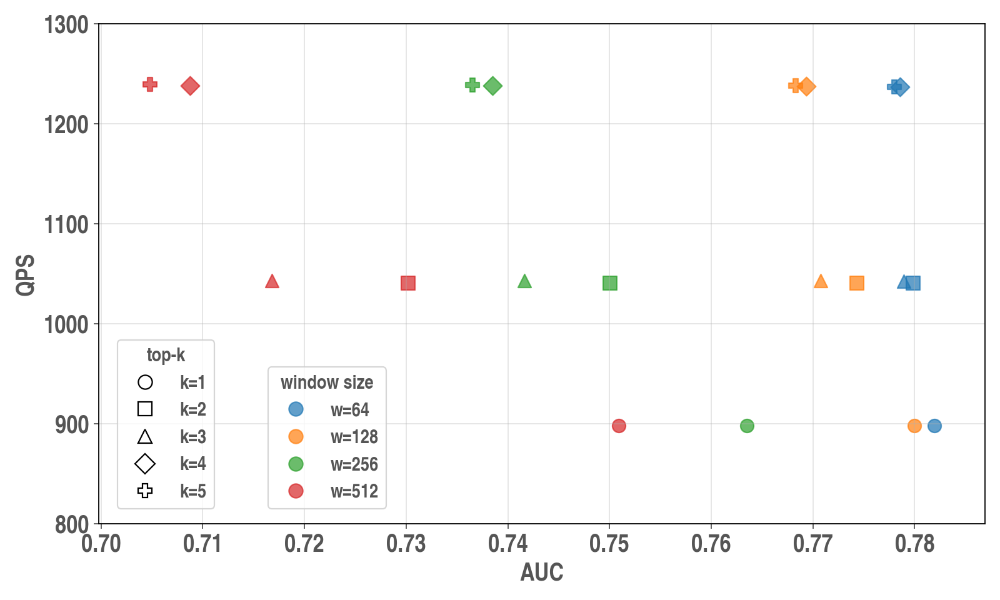

# 910C实验结果汇总

## 一、算法实验
| Dataset       | Model        | Action Reuse | AUC | NKV |
|----------------|-------------|---------------|-----|-----|
| KuaiRand-1k    | HSTU-small  | Off           | 0.659579 | 1.000000 |
|                |             | On            | 0.657711 | 0.516213 |
|                | HSTU-middle | Off           | 0.673809 | 1.000000 |
|                |             | On            | 0.673416 | 0.516460 |
|                | HSTU-large  | Off           | 0.698022 | 1.000000 |
|                |             | On            | 0.691697 | 0.526677 |
| MovieLens-20M  | HSTU-small  | Off           | 0.782854 | 1.000000 |
|                |             | On            | 0.781940 | 0.617011 |
|                | HSTU-middle | Off           | 0.782328 | 1.000000 |
|                |             | On            | 0.774358 | 0.603561 |
|                | HSTU-large  | Off           | 0.751251 | 1.000000 |
|                |             | On            | 0.751083 | 0.603960 |

## 二、Detailed Analysis
### （一）不同 AR 参数的选择
HSTU-small ; `window_size={64,128,256,512}` and `top_k={1,2,3,4,5}`. AUC is `task0.AUC`.

**Pareto Frontier:**

| window_size | top_k | AUC | Reuse Ratio | NKV | AUC Diff | simulation time (ms) | QPS |
|---:|---:|---:|---:|---:|---:|---:|---:|
| 64 | 4 | 0.784972 | 0.778551 | -0.006421 | 38.30% | 0.617021 | yes | 0.808529 | 1236.814 |

**Full Grid:**

| window_size | top_k | baseline AUC | AUC | AUC Diff | Reuse Ratio | NKV | Pareto | simulation time (ms) | QPS |
|---:|---:|---:|---:|---:|---:|---:|---|---:|---:|
| 64 | 1 | 0.784972 | 0.781921 | -0.003051 | 18.19% | 0.818088 | yes | 1.113440 | 898.118 |
| 64 | 2 | 0.784972 | 0.779868 | -0.005104 | 29.05% | 0.709469 | yes | 0.960765 | 1040.837 |
| 64 | 3 | 0.784972 | 0.778907 | -0.006065 | 35.28% | 0.647206 | yes | 0.959142 | 1042.598 |
| 64 | 4 | 0.784972 | 0.778551 | -0.006421 | 38.30% | 0.617021 | yes | 0.808529 | 1236.814 |
| 64 | 5 | 0.784972 | 0.778013 | -0.006958 | 39.64% | 0.603597 | yes | 0.808165 | 1237.371 |
| 128 | 1 | 0.784972 | 0.780002 | -0.004969 | 17.87% | 0.821337 | no | 1.113550 | 898.029 |
| 128 | 2 | 0.784972 | 0.774305 | -0.010666 | 29.42% | 0.705819 | no | 0.960683 | 1040.926 |
| 128 | 3 | 0.784972 | 0.770770 | -0.014202 | 36.55% | 0.634485 | no | 0.958779 | 1042.993 |
| 128 | 4 | 0.784972 | 0.769346 | -0.015626 | 40.44% | 0.595565 | yes | 0.807949 | 1237.702 |
| 128 | 5 | 0.784972 | 0.768319 | -0.016653 | 42.48% | 0.575179 | yes | 0.807428 | 1238.501 |
| 256 | 1 | 0.784972 | 0.763532 | -0.021439 | 17.42% | 0.825809 | no | 1.113660 | 897.940 |
| 256 | 2 | 0.784972 | 0.750073 | -0.034899 | 29.19% | 0.708055 | no | 0.960735 | 1040.870 |
| 256 | 3 | 0.784972 | 0.741643 | -0.043329 | 36.88% | 0.631207 | no | 0.958698 | 1043.081 |
| 256 | 4 | 0.784972 | 0.738514 | -0.046458 | 41.35% | 0.586541 | no | 0.807708 | 1238.071 |
| 256 | 5 | 0.784972 | 0.736534 | -0.048438 | 43.89% | 0.561088 | no | 0.807049 | 1239.082 |
| 512 | 1 | 0.784972 | 0.750914 | -0.034058 | 17.02% | 0.829823 | no | 1.113780 | 897.843 |
| 512 | 2 | 0.784972 | 0.730180 | -0.054792 | 28.90% | 0.710980 | no | 0.960804 | 1040.795 |
| 512 | 3 | 0.784972 | 0.716812 | -0.068160 | 36.91% | 0.630914 | no | 0.958694 | 1043.086 |
| 512 | 4 | 0.784972 | 0.708737 | -0.076235 | 41.76% | 0.582354 | no | 0.807625 | 1238.198 |
| 512 | 5 | 0.784972 | 0.704788 | -0.080184 | 44.74% | 0.552643 | no | 0.806799 | 1239.466 |

### （二）不同 IR recompute比例的实验
HSTU-small, cold , seq_len=4096, batch_size=1 ；仅 item recompute，不开启 Action KV Reuse。

| group | target ratio | history_recompute_len | simulation time (ms) | QPS | NPU util (%) | HBM util (%) | SSD util (%) |
| --- | ---: | ---: | ---: | ---: | ---: | ---: | ---: |
| continuous_0 | 0% | 0 | 1.417500 | 705.467 | 0.274680 | 1.029760 | 87.242400 |
| continuous_20 | 20% | 410 | 1.323620 | 755.504 | 0.576277 | 2.080410 | 85.515500 |
| continuous_40 | 40% | 819 | 1.184110 | 844.516 | 0.990936 | 3.241150 | 86.564600 |
| continuous_60 | 60% | 1229 | 1.092450 | 915.374 | 1.565640 | 4.584450 | 84.423600 |
| continuous_80 | 80% | 1638 | 0.962006 | 1039.495 | 2.401810 | 6.399250 | 84.966900 |
| continuous_100 | 100% | 2048 | 1.143430 | 874.562 | 2.684550 | 6.391270 | 62.309700 |
| continuous_optimal | 76.17% | 1560 | 0.957634 | 1044.240 | 2.361910 | 6.248880 | 87.433100 |
| random_20 | 20% | 410 | 1.435970 | 696.393 | 0.531203 | 1.917680 | 86.098400 |
| random_40 | 40% | 819 | 1.408810 | 709.819 | 0.832925 | 2.725240 | 87.479700 |
| random_60 | 60% | 1229 | 1.429490 | 699.550 | 1.196500 | 3.503730 | 86.192900 |
| random_80 | 80% | 1638 | 1.411330 | 708.552 | 1.638070 | 4.362530 | 86.855000 |
| random_100 | 100% | 2048 | 1.705070 | 586.486 | 1.800480 | 4.286490 | 71.433700 |
| random_optimal | 76.17% | 1560 | 1.369590 | 730.146 | 1.651450 | 4.369820 | 89.587600 |

### （三）out-of-order pipeline的消融实验
HSTU-small，cold/hot。 

| user | scale | baseline | baseline + AR | baseline + AR + IR, no out-of-order | baseline + AR + IR |
|---|---|---:|---:|---:|---:|
| cold | bs=1, kv_len=4096 | 1.417500 / 705.467 | 0.806727 / 1239.577 | 0.739381 / 1352.483 | 0.623868 / 1602.903 |
| cold | bs=1, kv_len=8192 | 2.615890 / 382.279 | 1.567290 / 638.044 | 1.439820 / 694.531 | 1.193350 / 837.977 |
| cold | bs=1, kv_len=16384 | 5.027700 / 198.898 | 2.915500 / 342.994 | 2.556070 / 391.226 | 2.066880 / 483.821 |
| cold | bs=4, kv_len=4096 | 5.153540 / 194.041 | 3.039720 / 328.978 | 1.945400 / 514.033 | 1.822800 / 548.607 |
| cold | bs=4, kv_len=8192 | 9.988850 / 100.112 | 5.759050 / 173.640 | 3.464490 / 288.643 | 2.965480 / 337.214 |
| cold | bs=4, kv_len=16384 | 19.689000 / 50.790 | 11.225500 / 89.083 | 6.639960 / 150.603 | 4.972770 / 201.095 |
| cold | bs=8, kv_len=4096 | 10.157000 / 98.454 | 5.927280 / 168.711 | 3.560230 / 280.881 | 3.189870 / 313.492 |
| cold | bs=8, kv_len=8192 | 19.848800 / 50.381 | 11.390300 / 87.794 | 6.009420 / 166.405 | 4.484780 / 222.976 |
| cold | bs=8, kv_len=16384 | 39.211600 / 25.503 | 22.292900 / 44.857 | 10.774000 / 92.816 | 7.702770 / 129.823 |
| hot | bs=1, kv_len=4096 | 0.401784 / 2488.900 | 0.228642 / 4373.650 | 0.231978 / 4310.754 | 0.228642 / 4373.650 |
| hot | bs=1, kv_len=8192 | 0.772394 / 1294.676 | 0.449145 / 2226.452 | 0.503183 / 1987.349 | 0.425864 / 2348.167 |
| hot | bs=1, kv_len=16384 | 1.527900 / 654.493 | 0.867146 / 1153.208 | 1.141780 / 875.825 | 0.918703 / 1088.491 |
| hot | bs=4, kv_len=4096 | 1.541250 / 648.824 | 0.879142 / 1137.473 | 0.937134 / 1067.083 | 0.848012 / 1179.229 |
| hot | bs=4, kv_len=8192 | 3.064280 / 326.341 | 1.737120 / 575.665 | 1.721430 / 580.912 | 1.546310 / 646.701 |
| hot | bs=4, kv_len=16384 | 6.139660 / 162.875 | 3.481670 / 287.218 | 3.215110 / 311.031 | 2.794160 / 357.889 |
| hot | bs=8, kv_len=4096 | 3.082480 / 324.414 | 1.755590 / 569.609 | 1.651770 / 605.411 | 1.514850 / 660.131 |
| hot | bs=8, kv_len=8192 | 6.150550 / 162.587 | 3.497650 / 285.906 | 3.000810 / 333.243 | 2.750140 / 363.618 |
| hot | bs=8, kv_len=16384 | 12.263900 / 81.540 | 6.958060 / 143.718 | 5.632700 / 177.535 | 4.922200 / 203.161 |

## 三、加速比对比实验

| model | seq_len | batch_size | user | full-cache | recompute | w_ar | w_ir | w_both |
|---|---:|---:|---|---:|---:|---:|---:|---:|
| HSTU-small | 4096 | 1 | hot | 0.401784 | 1.658560 | 0.228642 | 0.384116 | 0.228642 |
| HSTU-small | 4096 | 1 | cold | 1.417500 | 2.802250 | 0.806727 | 0.957634 | 0.623868 |
| HSTU-small | 4096 | 4 | hot | 1.541250 | 2.330400 | 0.879142 | 1.484580 | 0.848012 |
| HSTU-small | 4096 | 4 | cold | 5.153540 | 6.849620 | 3.039720 | 3.619870 | 1.822800 |
| HSTU-small | 4096 | 8 | hot | 3.082480 | 3.062890 | 1.755590 | 2.883650 | 1.514850 |
| HSTU-small | 4096 | 8 | cold | 10.157000 | 11.993800 | 5.927280 | 7.086530 | 3.189870 |
| HSTU-small | 8192 | 1 | hot | 0.772394 | 2.797690 | 0.449145 | 0.742737 | 0.425864 |
| HSTU-small | 8192 | 1 | cold | 2.615890 | 5.046450 | 1.567290 | 1.956050 | 1.193350 |
| HSTU-small | 8192 | 4 | hot | 3.064280 | 3.833670 | 1.737120 | 2.903070 | 1.546310 |
| HSTU-small | 8192 | 4 | cold | 9.988850 | 12.704100 | 5.759050 | 7.430130 | 2.965480 |
| HSTU-small | 8192 | 8 | hot | 6.150550 | 5.509680 | 3.497650 | 5.691770 | 2.750140 |
| HSTU-small | 8192 | 8 | cold | 19.848800 | 22.864000 | 11.390300 | 14.606800 | 4.484780 |
| HSTU-small | 16384 | 1 | hot | 1.527900 | 4.776770 | 0.867146 | 1.483200 | 0.918703 |
| HSTU-small | 16384 | 1 | cold | 5.027700 | 9.279530 | 2.915500 | 4.043000 | 2.066880 |
| HSTU-small | 16384 | 4 | hot | 6.139660 | 7.263770 | 3.481670 | 5.785760 | 2.794160 |
| HSTU-small | 16384 | 4 | cold | 19.689000 | 24.245000 | 11.225500 | 15.475300 | 4.972770 |
| HSTU-small | 16384 | 8 | hot | 12.263900 | 13.445000 | 6.958060 | 11.344400 | 4.922200 |
| HSTU-small | 16384 | 8 | cold | 39.211600 | 47.041500 | 22.292900 | 30.691200 | 7.702770 |
| HSTU-middle | 4096 | 1 | hot | 1.517590 | 3.886890 | 0.872018 | 1.464760 | 0.872018 |
| HSTU-middle | 4096 | 1 | cold | 5.167100 | 5.030700 | 3.069910 | 3.347500 | 1.994140 |
| HSTU-middle | 4096 | 4 | hot | 6.038680 | 5.502800 | 3.423270 | 5.121130 | 3.423270 |
| HSTU-middle | 4096 | 4 | cold | 19.737400 | 10.164400 | 11.316200 | 12.585400 | 6.727910 |
| HSTU-middle | 4096 | 8 | hot | 12.095000 | 8.814450 | 6.867260 | 10.056500 | 6.867260 |
| HSTU-middle | 4096 | 8 | cold | 39.190500 | 17.434900 | 22.352200 | 22.423900 | 12.378600 |
| HSTU-middle | 8192 | 1 | hot | 3.010320 | 6.222450 | 1.706870 | 2.666360 | 1.562490 |
| HSTU-middle | 8192 | 1 | cold | 9.972600 | 8.504480 | 5.766250 | 6.537840 | 3.696120 |
| HSTU-middle | 8192 | 4 | hot | 12.070100 | 10.582300 | 6.834680 | 10.284800 | 6.117850 |
| HSTU-middle | 8192 | 4 | cold | 39.018200 | 19.519700 | 22.172000 | 24.782500 | 13.324000 |
| HSTU-middle | 8192 | 8 | hot | 24.115800 | 16.723600 | 13.659400 | 20.355900 | 12.066800 |
| HSTU-middle | 8192 | 8 | cold | 77.710300 | 34.329400 | 44.031000 | 49.078500 | 26.178300 |
| HSTU-middle | 16384 | 1 | hot | 6.010870 | 10.417700 | 3.395350 | 5.375200 | 3.139130 |
| HSTU-middle | 16384 | 1 | cold | 19.597800 | 14.890800 | 11.176300 | 13.910400 | 7.450440 |
| HSTU-middle | 16384 | 4 | hot | 24.114200 | 19.884700 | 13.626600 | 20.981300 | 12.202500 |
| HSTU-middle | 16384 | 4 | cold | 77.562000 | 37.303500 | 43.851200 | 54.233700 | 28.490500 |
| HSTU-middle | 16384 | 8 | hot | 48.178900 | 35.545200 | 27.259600 | 41.716000 | 24.169700 |
| HSTU-middle | 16384 | 8 | cold | 154.771000 | 80.002200 | 87.407300 | 107.985000 | 56.839700 |
| HSTU-large | 4096 | 1 | hot | 4.501240 | 7.638200 | 2.552240 | 4.101490 | 2.552240 |
| HSTU-large | 4096 | 1 | cold | 14.925000 | 8.752570 | 8.621700 | 9.504760 | 4.466200 |
| HSTU-large | 4096 | 4 | hot | 18.022000 | 14.139800 | 10.207600 | 13.936800 | 10.207600 |
| HSTU-large | 4096 | 4 | cold | 58.368300 | 18.390200 | 33.138300 | 36.035700 | 14.292950 |
| HSTU-large | 4096 | 8 | hot | 35.919700 | 24.526500 | 20.338200 | 27.674400 | 20.338200 |
| HSTU-large | 4096 | 8 | cold | 116.163000 | 32.997100 | 65.747000 | 61.170700 | 24.990780 |
| HSTU-large | 8192 | 1 | hot | 8.982660 | 14.555100 | 5.076100 | 7.297390 | 4.453380 |
| HSTU-large | 8192 | 1 | cold | 29.344000 | 16.763500 | 16.728800 | 18.336200 | 9.606090 |
| HSTU-large | 8192 | 4 | hot | 35.979000 | 33.504500 | 20.334100 | 28.502900 | 17.365500 |
| HSTU-large | 8192 | 4 | cold | 116.073000 | 42.040000 | 65.598100 | 71.714800 | 27.780980 |
| HSTU-large | 8192 | 8 | hot | 71.745300 | 55.628600 | 40.569200 | 56.834300 | 34.511700 |
| HSTU-large | 8192 | 8 | cold | 231.486000 | 72.059100 | 130.646000 | 128.739000 | 54.600900 |
| HSTU-large | 16384 | 1 | hot | 18.001700 | 25.805900 | 10.168200 | 14.970400 | 8.879410 |
| HSTU-large | 16384 | 1 | cold | 58.237300 | 29.954700 | 32.986800 | 36.802700 | 20.247200 |
| HSTU-large | 16384 | 4 | hot | 71.892200 | 75.172000 | 40.613900 | 59.083100 | 34.900100 |
| HSTU-large | 16384 | 4 | cold | 231.490000 | 92.113300 | 130.539000 | 145.154000 | 78.883900 |
| HSTU-large | 16384 | 8 | hot | 143.370000 | 139.130000 | 81.024800 | 117.968000 | 69.564000 |
| HSTU-large | 16384 | 8 | cold | 462.105000 | 172.169000 | 260.876000 | 289.750000 | 157.719400 |

