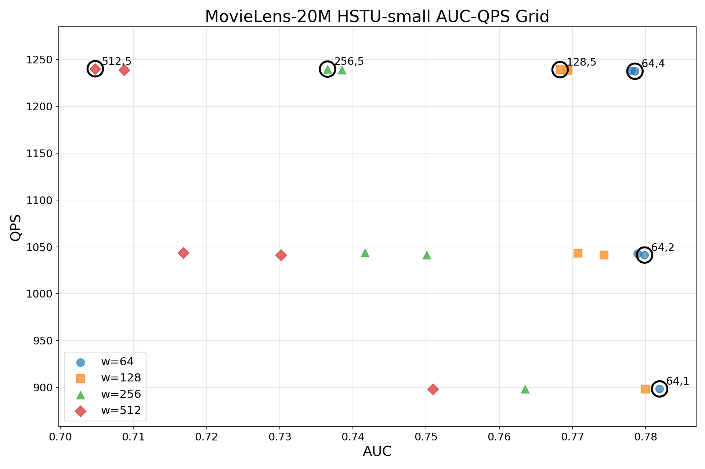

# 910C实验结果汇总

## 一、算法实验
| Dataset       | Model        | Action Reuse | AUC | NKV |
|----------------|-------------|---------------|-----|-----|
| KuaiRand-1k    | HSTU-small  | Off           | 0.759071 | 1.000000 |
|                |             | On            | 0.744496 | 0.516492 |
|                | HSTU-middle | Off           | 0.685225 | 1.000000 |
|                |             | On            | 0.680404 | 0.516492 |
|                | HSTU-large  | Off           | 0.625479 | 1.000000 |
|                |             | On            | 0.612859 | 0.516492 |
| MovieLens-20M  | HSTU-small  | Off           | 0.786133 | 1.000000 |
|                |             | On            | 0.776942 | 0.603561 |
|                | HSTU-middle | Off           | 0.782328 | 1.000000 |
|                |             | On            | 0.774358 | 0.603561 |
|                | HSTU-large  | Off           | 0.751251 | 1.000000 |
|                |             | On            | 0.751083 | 0.603960 |

## 二、Detailed Analysis
### （一）不同 AR 参数的选择
HSTU-small ; `window_size={64,128,256,512}` and `top_k={1,2,3,4,5}`. AUC is `task0.AUC`.

**Pareto Frontier:**

| window_size | top_k | AUC | Reuse Ratio | NKV | AUC Diff | simulation time (ms) | QPS |
|---:|---:|---:|---:|---:|---:|---:|---:|
| 512 | 5 | 0.704788 | 44.74% | 0.552643 | -0.080184 | 0.806466 | 1239.978 |
| 256 | 5 | 0.736534 | 43.89% | 0.561088 | -0.048438 | 0.806714 | 1239.597 |
| 128 | 5 | 0.768319 | 42.48% | 0.575179 | -0.016653 | 0.807091 | 1239.018 |
| 64 | 4 | 0.778551 | 38.30% | 0.617021 | -0.006421 | 0.808194 | 1237.327 |
| 64 | 2 | 0.779868 | 29.05% | 0.709469 | -0.005104 | 0.960427 | 1041.204 |
| 64 | 1 | 0.781921 | 18.19% | 0.818088 | -0.003051 | 1.113100 | 898.392 |

**Recommended Points:**

(64,4)

**Full Grid:**

| window_size | top_k | baseline AUC | AUC | AUC Diff | Reuse Ratio | NKV | Pareto | simulation time (ms) | QPS |
|---:|---:|---:|---:|---:|---:|---:|---|---:|---:|
| 64 | 1 | 0.784972 | 0.781921 | -0.003051 | 18.19% | 0.818088 | yes | 1.113100 | 898.392 |
| 64 | 2 | 0.784972 | 0.779868 | -0.005104 | 29.05% | 0.709469 | yes | 0.960427 | 1041.204 |
| 64 | 3 | 0.784972 | 0.778907 | -0.006065 | 35.28% | 0.647206 | yes | 0.958798 | 1042.973 |
| 64 | 4 | 0.784972 | 0.778551 | -0.006421 | 38.30% | 0.617021 | yes | 0.808194 | 1237.327 |
| 64 | 5 | 0.784972 | 0.778013 | -0.006958 | 39.64% | 0.603597 | yes | 0.807820 | 1237.900 |
| 128 | 1 | 0.784972 | 0.780002 | -0.004969 | 17.87% | 0.821337 | no | 1.113210 | 898.303 |
| 128 | 2 | 0.784972 | 0.774305 | -0.010666 | 29.42% | 0.705819 | no | 0.960346 | 1041.291 |
| 128 | 3 | 0.784972 | 0.770770 | -0.014202 | 36.55% | 0.634485 | no | 0.958428 | 1043.375 |
| 128 | 4 | 0.784972 | 0.769346 | -0.015626 | 40.44% | 0.595565 | yes | 0.807604 | 1238.231 |
| 128 | 5 | 0.784972 | 0.768319 | -0.016653 | 42.48% | 0.575179 | yes | 0.807091 | 1239.018 |
| 256 | 1 | 0.784972 | 0.763532 | -0.021439 | 17.42% | 0.825809 | no | 1.113300 | 898.230 |
| 256 | 2 | 0.784972 | 0.750073 | -0.034899 | 29.19% | 0.708055 | no | 0.960392 | 1041.241 |
| 256 | 3 | 0.784972 | 0.741643 | -0.043329 | 36.88% | 0.631207 | no | 0.958364 | 1043.445 |
| 256 | 4 | 0.784972 | 0.738514 | -0.046458 | 41.35% | 0.586541 | no | 0.807358 | 1238.608 |
| 256 | 5 | 0.784972 | 0.736534 | -0.048438 | 43.89% | 0.561088 | yes | 0.806714 | 1239.597 |
| 512 | 1 | 0.784972 | 0.750914 | -0.034058 | 17.02% | 0.829823 | no | 1.113440 | 898.118 |
| 512 | 2 | 0.784972 | 0.730180 | -0.054792 | 28.90% | 0.710980 | no | 0.960464 | 1041.163 |
| 512 | 3 | 0.784972 | 0.716812 | -0.068160 | 36.91% | 0.630914 | no | 0.958354 | 1043.456 |
| 512 | 4 | 0.784972 | 0.708737 | -0.076235 | 41.76% | 0.582354 | no | 0.807277 | 1238.732 |
| 512 | 5 | 0.784972 | 0.704788 | -0.080184 | 44.74% | 0.552643 | yes | 0.806466 | 1239.978 |

### （二）不同 IR recompute比例的实验
HSTU-small, cold；仅 item recompute，不开启 Action KV Reuse。continuous 为连续索引模式，random 为随机索引模式。

| group | target ratio | history_recompute_len | simulation time (ms) | QPS | NPU util (%) | HBM util (%) | SSD util (%) |
| --- | ---: | ---: | ---: | ---: | ---: | ---: | ---: |
| continuous_0 | 0% | 0 | 1.417530 | 705.452 | 0.558213 | 1.02974 | 87.2405 |
| continuous_20 | 20% | 410 | 1.344230 | 743.920 | 2.00045 | 2.08702 | 84.1963 |
| continuous_40 | 40% | 819 | 1.232720 | 811.214 | 3.31326 | 3.25175 | 83.1658 |
| continuous_60 | 60% | 1229 | 1.160660 | 861.579 | 4.68664 | 4.47819 | 79.4531 |
| continuous_80 | 80% | 1638 | 1.249120 | 800.564 | 5.16668 | 4.74148 | 65.4457 |
| continuous_100 | 100% | 2048 | 1.406630 | 710.919 | 5.44626 | 5.35868 | 50.6539 |
| continuous_optimal | 59.47% | 1218 | 1.160160 | 861.950 | 4.67682 | 4.45876 | 79.7398 |
| random_20 | 20% | 410 | 1.456580 | 686.540 | 1.84621 | 1.9261 | 84.8728 |
| random_40 | 40% | 819 | 1.457410 | 686.149 | 2.80349 | 2.75138 | 84.5743 |
| random_60 | 60% | 1229 | 1.497700 | 667.690 | 3.63223 | 3.47067 | 82.2596 |
| random_80 | 80% | 1638 | 1.698460 | 588.769 | 3.80009 | 3.48736 | 72.1772 |
| random_100 | 100% | 2048 | 1.968370 | 508.035 | 3.89229 | 3.8297 | 61.8804 |
| random_optimal | 0% | 0 | 1.417530 | 705.452 | 0.558213 | 1.02974 | 87.2405 |

### （三）out-of-order pipeline的消融实验
HSTU-small，cold。

| scale | baseline | baseline + AR | baseline + AR + IR, no out-of-order | baseline + AR + IR |
|---|---:|---:|---:|---:|
| bs=1, kv_len=4096 | 705.452 | 1241.282 | 1363.089 | 1682.901 |
| bs=1, kv_len=8192 | 378.437 | 704.895 | 776.584 | 849.466 |
| bs=1, kv_len=16384 | 198.444 | 378.434 | 352.652 | 388.313 |
| bs=4, kv_len=4096 | 193.728 | 361.652 | 411.853 | 432.565 |
| bs=4, kv_len=8192 | 100.128 | 188.265 | 191.660 | 232.801 |
| bs=4, kv_len=16384 | 50.726 | 97.105 | 97.248 | 113.766 |
| bs=8, kv_len=4096 | 98.475 | 182.643 | 218.835 | 242.711 |
| bs=8, kv_len=8192 | 50.334 | 95.541 | 111.421 | 126.553 |
| bs=8, kv_len=16384 | 25.480 | 48.452 | 54.683 | 61.526 |

## 三、P99Latency
HSTU-large，seq_len=8192

| request_rate (req/s) | cold P99 latency (ms) | hot P99 latency (ms) |
|---:|---:|---:|
| 16 | 10.982000 | 2.387130 |
| 32 | 10.982000 | 2.387130 |
| 48 | 10.982000 | 2.387130 |
| 64 | 10.982000 | 2.387130 |
| 80 | 10.982000 | 2.387130 |
| 96 | 60.629380 | 2.387130 |
| 128 | 404.774583 | 2.387130 |

## 四、加速比对比实验

| model | seq_len | batch_size | user | full-cache | recompute | w_ar | w_ir | w_both |
|---|---:|---:|---|---:|---:|---:|---:|---:|
| HSTU-small | 4096 | 1 | hot | 0.216867 | 1.731960 | 0.129666 | 0.216867 | 0.129666 |
| HSTU-small | 4096 | 1 | cold | 1.417530 | 1.906450 | 0.805619 | 1.160160 | 0.594212 |
| HSTU-small | 4096 | 4 | hot | 0.809198 | 3.390490 | 0.506608 | 0.809198 | 0.506608 |
| HSTU-small | 4096 | 4 | cold | 5.161880 | 4.064480 | 2.765090 | 4.201610 | 2.311790 |
| HSTU-small | 4096 | 8 | hot | 1.599420 | 4.219820 | 0.959597 | 1.599420 | 0.959597 |
| HSTU-small | 4096 | 8 | cold | 10.154900 | 5.523390 | 5.475170 | 7.256740 | 4.120130 |
| HSTU-small | 8192 | 1 | hot | 0.428710 | 3.610680 | 0.225789 | 0.428710 | 0.225789 |
| HSTU-small | 8192 | 1 | cold | 2.642450 | 3.939270 | 1.418650 | 2.429920 | 1.177210 |
| HSTU-small | 8192 | 4 | hot | 1.581650 | 5.027960 | 0.840316 | 1.581650 | 0.840316 |
| HSTU-small | 8192 | 4 | cold | 9.987210 | 6.267390 | 5.311670 | 8.261930 | 4.295520 |
| HSTU-small | 8192 | 8 | hot | 3.206580 | 6.939140 | 1.673890 | 3.206580 | 1.673890 |
| HSTU-small | 8192 | 8 | cold | 19.867300 | 9.369340 | 10.466700 | 14.869900 | 7.901800 |
| HSTU-small | 16384 | 1 | hot | 0.798944 | 6.150810 | 0.444294 | 0.798944 | 0.444294 |
| HSTU-small | 16384 | 1 | cold | 5.039210 | 6.732510 | 2.642470 | 5.751210 | 2.575240 |
| HSTU-small | 16384 | 4 | hot | 3.202130 | 8.865340 | 1.654770 | 3.202130 | 1.654770 |
| HSTU-small | 16384 | 4 | cold | 19.713600 | 11.117400 | 10.298100 | 17.308300 | 8.790010 |
| HSTU-small | 16384 | 8 | hot | 6.374790 | 14.795300 | 3.352780 | 6.374790 | 3.352780 |
| HSTU-small | 16384 | 8 | cold | 39.247200 | 19.236300 | 20.638800 | 31.676300 | 16.253200 |
| HSTU-middle | 4096 | 1 | hot | 0.803656 | 5.354830 | 0.423985 | 0.803656 | 0.423985 |
| HSTU-middle | 4096 | 1 | cold | 5.193670 | 5.678520 | 2.771450 | 3.766920 | 2.048380 |
| HSTU-middle | 4096 | 4 | hot | 3.072910 | 7.912320 | 1.626370 | 3.072910 | 1.626370 |
| HSTU-middle | 4096 | 4 | cold | 19.733900 | 9.150490 | 10.418700 | 12.736100 | 6.590470 |
| HSTU-middle | 4096 | 8 | hot | 6.187850 | 11.453700 | 3.243730 | 6.187850 | 3.243730 |
| HSTU-middle | 4096 | 8 | cold | 39.209100 | 13.893400 | 20.528800 | 23.128700 | 12.301400 |
| HSTU-middle | 8192 | 1 | hot | 1.545410 | 8.598450 | 0.836144 | 1.545410 | 0.836144 |
| HSTU-middle | 8192 | 1 | cold | 9.988550 | 9.180340 | 5.195030 | 9.727050 | 4.539090 |
| HSTU-middle | 8192 | 4 | hot | 6.166030 | 13.569100 | 3.208390 | 6.166030 | 3.208390 |
| HSTU-middle | 8192 | 4 | cold | 39.038700 | 15.785700 | 20.344800 | 25.755400 | 12.510700 |
| HSTU-middle | 8192 | 8 | hot | 12.313500 | 23.094400 | 6.469970 | 12.313500 | 6.469970 |
| HSTU-middle | 8192 | 8 | cold | 77.758000 | 27.596500 | 40.742000 | 47.904900 | 23.916000 |
| HSTU-middle | 16384 | 1 | hot | 3.046880 | 14.141000 | 1.605990 | 3.046880 | 1.605990 |
| HSTU-middle | 16384 | 1 | cold | 19.595800 | 15.228300 | 10.286700 | 17.526800 | 9.890230 |
| HSTU-middle | 16384 | 4 | hot | 12.295500 | 29.691100 | 6.423260 | 12.295500 | 6.423260 |
| HSTU-middle | 16384 | 4 | cold | 77.591600 | 33.969000 | 40.546400 | 43.872000 | 25.921200 |
| HSTU-middle | 16384 | 8 | hot | 24.575700 | 54.657000 | 12.900100 | 24.575700 | 12.900100 |
| HSTU-middle | 16384 | 8 | cold | 154.867000 | 63.184800 | 80.846300 | — | 43.112100 |
| HSTU-large | 4096 | 1 | hot | 2.294190 | 11.094600 | 1.255110 | 2.294190 | 1.255110 |
| HSTU-large | 4096 | 1 | cold | 14.939700 | 11.676500 | 7.749490 | 10.695800 | 6.246220 |
| HSTU-large | 4096 | 4 | hot | 9.166460 | 18.694100 | 4.784520 | 9.166460 | 4.784520 |
| HSTU-large | 4096 | 4 | cold | 58.400000 | 20.946600 | 30.412700 | 35.610000 | 15.402100 |
| HSTU-large | 4096 | 8 | hot | — | 30.552600 | 9.606310 | — | 9.606310 |
| HSTU-large | 4096 | 8 | cold | 116.296000 | 35.098900 | 60.863400 | — | 26.352800 |
| HSTU-large | 8192 | 1 | hot | 4.535210 | 17.988300 | 2.387130 | 4.535210 | 2.387130 |
| HSTU-large | 8192 | 1 | cold | 29.339700 | 19.076200 | 15.389100 | — | 10.982000 |
| HSTU-large | 8192 | 4 | hot | 18.265100 | 37.621700 | 9.538230 | 18.265100 | 9.538230 |
| HSTU-large | 8192 | 4 | cold | 116.133000 | 41.899800 | 60.648200 | — | 29.755500 |
| HSTU-large | 8192 | 8 | hot | 36.460500 | 66.257600 | 19.127600 | 36.460500 | 19.127600 |
| HSTU-large | 8192 | 8 | cold | 231.748000 | 74.871000 | 120.897000 | — | 51.639300 |
| HSTU-large | 16384 | 1 | hot | 9.105570 | 32.159800 | 4.731740 | 9.105570 | 4.731740 |
| HSTU-large | 16384 | 1 | cold | 58.227700 | 34.254600 | — | — | 20.345900 |
| HSTU-large | 16384 | 4 | hot | 36.490000 | — | 19.065300 | 36.490000 | 19.065300 |
| HSTU-large | 16384 | 4 | cold | — | 95.831200 | 120.687000 | — | 63.999700 |
| HSTU-large | 16384 | 8 | hot | — | — | 38.193600 | — | 38.193600 |
| HSTU-large | 16384 | 8 | cold | — | — | — | — | 112.163000 |

