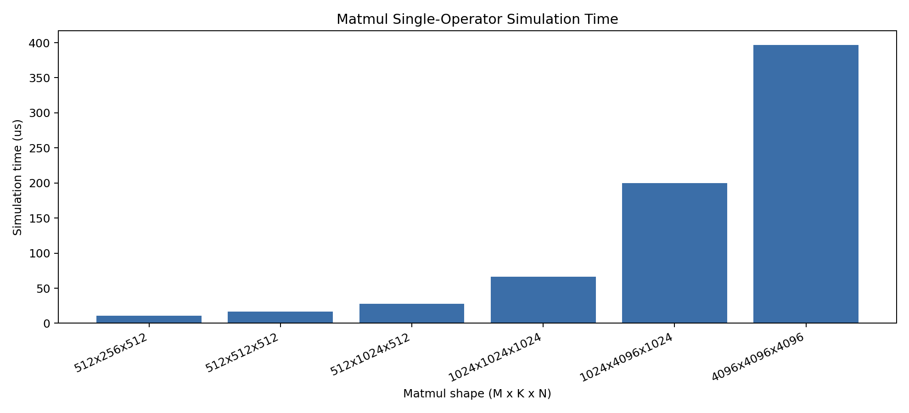
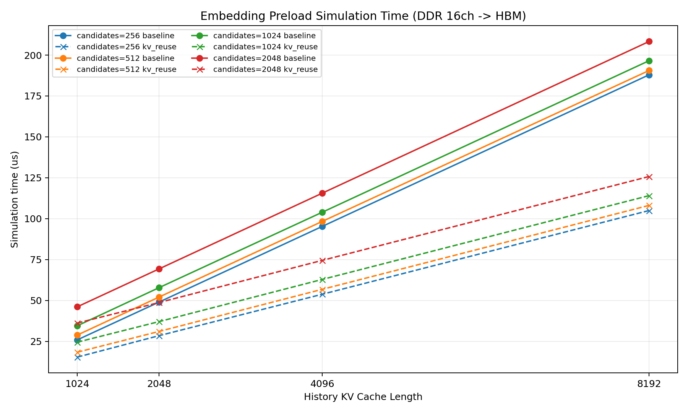
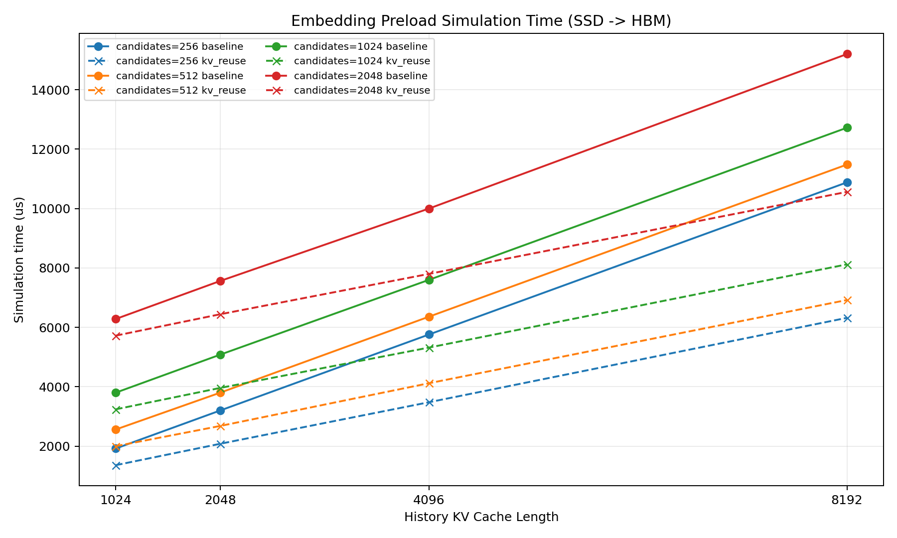
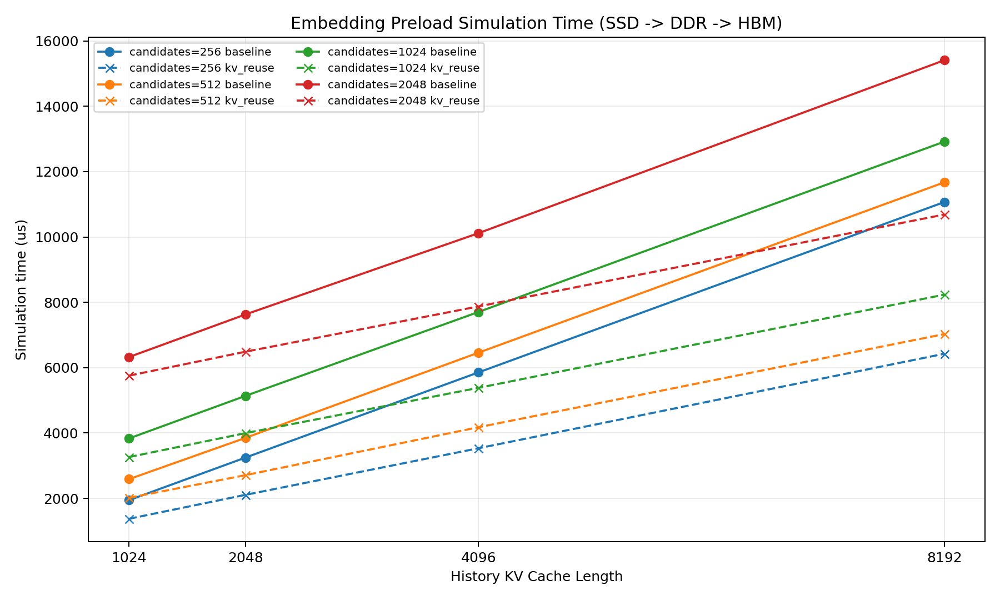
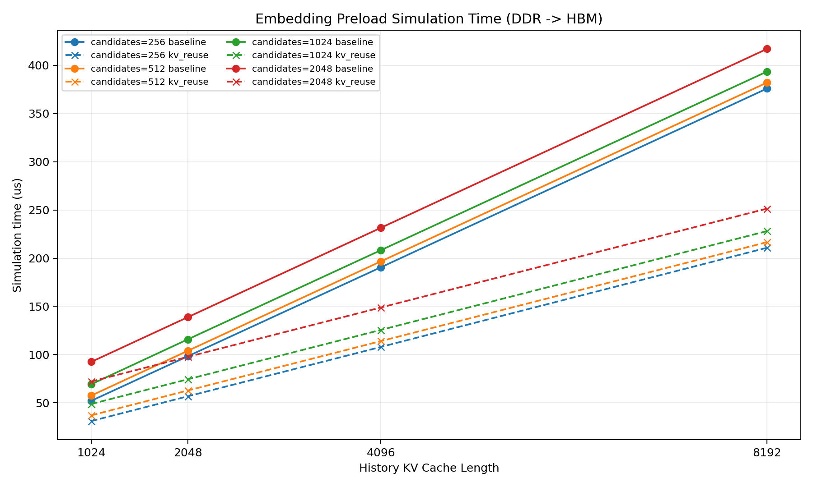

# GEMM/EMB 算子测试

## 1. 测试设置

- 所有实验使用 `configs/baseline.json` 作为硬件配置。
- KV reuse 对比使用 `window_size=1024, topk=4, hot_share=90%`
- 当前使用ddr channel=16测试，暂未修改src/Hashing.cc中的映射方法。HBM侧和mini配置不受影响。

## 2. Matmul 单算子结果

| M | K | N | simulation time/us | wall-clock/s |
| --- | --- | --- | --- | --- |
| 512 | 256 | 512 | 11.052910 | 0.381 |
| 512 | 512 | 512 | 16.579365 | 0.545 |
| 512 | 1024 | 512 | 27.618730 | 0.839 |
| 1024 | 1024 | 1024 | 66.283380 | 1.876 |
| 1024 | 4096 | 1024 | 200.058650 | 5.764 |
| 4096 | 4096 | 4096 | 397.057925 | 69.472 |

## 3. Embedding 单算子结果

### （1）DDR -> HBM

| candidate | history | method | total vectors read | history vectors read | simulation time/us | wall-clock/s |
| --- | --- | --- | --- | --- | --- | --- |
| 256 | 1024 | baseline | 2304 | 2048 | 25.860710 | 3.238 |
| 256 | 1024 | kv_reuse | 1390 | 1134 | 15.349270 | 2.003 |
| 256 | 2048 | baseline | 4352 | 4096 | 48.944220 | 6.385 |
| 256 | 2048 | kv_reuse | 2524 | 2268 | 28.428310 | 3.661 |
| 256 | 4096 | baseline | 8448 | 8192 | 95.269750 | 11.579 |
| 256 | 4096 | kv_reuse | 4792 | 4536 | 53.793840 | 6.735 |
| 256 | 8192 | baseline | 16640 | 16384 | 187.941770 | 22.310 |
| 256 | 8192 | kv_reuse | 9328 | 9072 | 104.970300 | 12.728 |
| 512 | 1024 | baseline | 2560 | 2048 | 28.800350 | 3.640 |
| 512 | 1024 | kv_reuse | 1646 | 1134 | 18.343930 | 2.538 |
| 512 | 2048 | baseline | 4608 | 4096 | 52.010930 | 6.513 |
| 512 | 2048 | kv_reuse | 2780 | 2268 | 31.027350 | 4.039 |
| 512 | 4096 | baseline | 8704 | 8192 | 98.333840 | 12.513 |
| 512 | 4096 | kv_reuse | 5048 | 4536 | 56.809460 | 7.241 |
| 512 | 8192 | baseline | 16896 | 16384 | 190.578800 | 24.714 |
| 512 | 8192 | kv_reuse | 9584 | 9072 | 108.111680 | 13.826 |
| 1024 | 1024 | baseline | 3072 | 2048 | 34.483130 | 4.534 |
| 1024 | 1024 | kv_reuse | 2158 | 1134 | 24.455080 | 3.483 |
| 1024 | 2048 | baseline | 5120 | 4096 | 57.760520 | 7.599 |
| 1024 | 2048 | kv_reuse | 3292 | 2268 | 37.033700 | 4.970 |
| 1024 | 4096 | baseline | 9216 | 8192 | 103.932780 | 13.587 |
| 1024 | 4096 | kv_reuse | 5560 | 4536 | 62.851180 | 7.718 |
| 1024 | 8192 | baseline | 17408 | 16384 | 196.565500 | 25.169 |
| 1024 | 8192 | kv_reuse | 10096 | 9072 | 114.073490 | 14.673 |
| 2048 | 1024 | baseline | 4096 | 2048 | 46.075320 | 6.503 |
| 2048 | 1024 | kv_reuse | 3182 | 1134 | 36.149450 | 5.376 |
| 2048 | 2048 | baseline | 6144 | 4096 | 69.238740 | 9.010 |
| 2048 | 2048 | kv_reuse | 4316 | 2268 | 48.688770 | 6.834 |
| 2048 | 4096 | baseline | 10240 | 8192 | 115.593090 | 15.292 |
| 2048 | 4096 | kv_reuse | 6584 | 4536 | 74.506250 | 10.033 |
| 2048 | 8192 | baseline | 18432 | 16384 | 208.320130 | 25.556 |
| 2048 | 8192 | kv_reuse | 11120 | 9072 | 125.766550 | 16.413 |

### （2） SSD -> HBM

| candidate | history | method | total vectors read | history vectors read | simulation time/us | wall-clock/s |
| --- | --- | --- | --- | --- | --- | --- |
| 256 | 1024 | baseline | 2304 | 2048 | 1920.004120 | 83.377 |
| 256 | 1024 | kv_reuse | 1390 | 1134 | 1360.004010 | 63.008 |
| 256 | 2048 | baseline | 4352 | 4096 | 3200.005120 | 143.968 |
| 256 | 2048 | kv_reuse | 2524 | 2268 | 2080.004900 | 97.287 |
| 256 | 4096 | baseline | 8448 | 8192 | 5760.004500 | 261.146 |
| 256 | 4096 | kv_reuse | 4792 | 4536 | 3480.004520 | 158.233 |
| 256 | 8192 | baseline | 16640 | 16384 | 10880.004570 | 489.212 |
| 256 | 8192 | kv_reuse | 9328 | 9072 | 6320.004610 | 287.416 |
| 512 | 1024 | baseline | 2560 | 2048 | 2560.004620 | 116.889 |
| 512 | 1024 | kv_reuse | 1646 | 1134 | 2000.004510 | 86.661 |
| 512 | 2048 | baseline | 4608 | 4096 | 3800.004770 | 173.226 |
| 512 | 2048 | kv_reuse | 2780 | 2268 | 2680.004550 | 121.976 |
| 512 | 4096 | baseline | 8704 | 8192 | 6360.004150 | 290.033 |
| 512 | 4096 | kv_reuse | 5048 | 4536 | 4120.005020 | 191.233 |
| 512 | 8192 | baseline | 16896 | 16384 | 11480.005530 | 512.119 |
| 512 | 8192 | kv_reuse | 9584 | 9072 | 6920.005570 | 333.018 |
| 1024 | 1024 | baseline | 3072 | 2048 | 3800.004770 | 174.556 |
| 1024 | 1024 | kv_reuse | 2158 | 1134 | 3240.004660 | 157.832 |
| 1024 | 2048 | baseline | 5120 | 4096 | 5080.004460 | 237.932 |
| 1024 | 2048 | kv_reuse | 3292 | 2268 | 3960.005550 | 172.759 |
| 1024 | 4096 | baseline | 9216 | 8192 | 7600.004300 | 351.481 |
| 1024 | 4096 | kv_reuse | 5560 | 4536 | 5320.004320 | 241.685 |
| 1024 | 8192 | baseline | 17408 | 16384 | 12720.004370 | 583.939 |
| 1024 | 8192 | kv_reuse | 10096 | 9072 | 8120.004870 | 376.124 |
| 2048 | 1024 | baseline | 4096 | 2048 | 6280.005070 | 294.362 |
| 2048 | 1024 | kv_reuse | 3182 | 1134 | 5720.004960 | 261.303 |
| 2048 | 2048 | baseline | 6144 | 4096 | 7560.004760 | 345.415 |
| 2048 | 2048 | kv_reuse | 4316 | 2268 | 6440.004540 | 290.849 |
| 2048 | 4096 | baseline | 10240 | 8192 | 10000.004210 | 453.841 |
| 2048 | 4096 | kv_reuse | 6584 | 4536 | 7800.004620 | 354.561 |
| 2048 | 8192 | baseline | 18432 | 16384 | 15200.004670 | 729.802 |
| 2048 | 8192 | kv_reuse | 11120 | 9072 | 10560.005630 | 537.011 |

### （3） SSD 直达 HBM 与 SSD->DDR->HBM对比

| candidate | history | method | SSD->HBM/us | SSD->DDR->HBM/us | 普通路径/直达路径 |
| --- | --- | --- | --- | --- | --- |
| 256 | 1024 | baseline | 1920.004120 | 1945.779680 | 1.013x |
| 256 | 1024 | kv_reuse | 1360.004010 | 1375.287780 | 1.011x |
| 256 | 2048 | baseline | 3200.005120 | 3248.925760 | 1.015x |
| 256 | 2048 | kv_reuse | 2080.004900 | 2108.422730 | 1.014x |
| 256 | 4096 | baseline | 5760.004500 | 5855.248050 | 1.017x |
| 256 | 4096 | kv_reuse | 3480.004520 | 3533.783950 | 1.015x |
| 256 | 8192 | baseline | 10880.004570 | 11067.937170 | 1.017x |
| 256 | 8192 | kv_reuse | 6320.004610 | 6424.959190 | 1.017x |
| 512 | 1024 | baseline | 2560.004620 | 2588.782700 | 1.011x |
| 512 | 1024 | kv_reuse | 2000.004510 | 2018.294730 | 1.009x |
| 512 | 2048 | baseline | 3800.004770 | 3851.933170 | 1.014x |
| 512 | 2048 | kv_reuse | 2680.004550 | 2710.982120 | 1.012x |
| 512 | 4096 | baseline | 6360.004150 | 6458.254150 | 1.015x |
| 512 | 4096 | kv_reuse | 4120.005020 | 4176.792210 | 1.014x |
| 512 | 8192 | baseline | 11480.005530 | 11670.488700 | 1.017x |
| 512 | 8192 | kv_reuse | 6920.005570 | 7027.958740 | 1.016x |
| 1024 | 1024 | baseline | 3800.004770 | 3834.345110 | 1.009x |
| 1024 | 1024 | kv_reuse | 3240.004660 | 3264.310400 | 1.008x |
| 1024 | 2048 | baseline | 5080.004460 | 5137.499050 | 1.011x |
| 1024 | 2048 | kv_reuse | 3960.005550 | 3996.993400 | 1.009x |
| 1024 | 4096 | baseline | 7600.004300 | 7703.837520 | 1.014x |
| 1024 | 4096 | kv_reuse | 5320.004320 | 5382.810960 | 1.012x |
| 1024 | 8192 | baseline | 12720.004370 | 12916.480790 | 1.015x |
| 1024 | 8192 | kv_reuse | 8120.004870 | 8233.994520 | 1.014x |
| 2048 | 1024 | baseline | 6280.005070 | 6325.919260 | 1.007x |
| 2048 | 1024 | kv_reuse | 5720.004960 | 5755.896340 | 1.006x |
| 2048 | 2048 | baseline | 7560.004760 | 7629.081060 | 1.009x |
| 2048 | 2048 | kv_reuse | 6440.004540 | 6488.564930 | 1.008x |
| 2048 | 4096 | baseline | 10000.004210 | 10115.408660 | 1.012x |
| 2048 | 4096 | kv_reuse | 7800.004620 | 7874.375940 | 1.010x |
| 2048 | 8192 | baseline | 15200.004670 | 15408.075900 | 1.014x |
| 2048 | 8192 | kv_reuse | 10560.005630 | 10685.550790 | 1.012x |

## 附：原channel=12测试结果

Embedding 四种方法：

1. `sequential_all`：相同总规模下 indices 完全连续。
2. `random_all`：相同总规模下 indices 完全随机。
3. `baseline`：候选随机，历史 K/V 连续。
4. `kv_reuse`：候选随机，历史 K/V 连续，但历史长度按 window-topk 复用后的实际读取规模计算。

| candidate | history | method | total vectors read | history vectors read | simulation time/us | wall-clock/s |
| --- | --- | --- | --- | --- | --- | --- |
| 256 | 1024 | baseline | 2304 | 2048 | 52.128830 | 3.583 |
| 256 | 1024 | kv_reuse | 1390 | 1134 | 31.108570 | 2.568 |
| 256 | 1024 | random_all | 2304 | 2048 | 52.200880 | 4.405 |
| 256 | 1024 | sequential_all | 2304 | 2048 | 51.928400 | 3.760 |
| 256 | 2048 | baseline | 4352 | 4096 | 98.320740 | 6.670 |
| 256 | 2048 | kv_reuse | 2524 | 2268 | 56.804220 | 3.871 |
| 256 | 2048 | random_all | 4352 | 4096 | 98.669200 | 7.319 |
| 256 | 2048 | sequential_all | 4352 | 4096 | 98.267030 | 7.101 |
| 256 | 4096 | baseline | 8448 | 8192 | 190.515920 | 12.711 |
| 256 | 4096 | kv_reuse | 4792 | 4536 | 107.968890 | 7.831 |
| 256 | 4096 | random_all | 8448 | 8192 | 191.713260 | 14.022 |
| 256 | 4096 | sequential_all | 8448 | 8192 | 190.459590 | 12.516 |
| 256 | 8192 | baseline | 16640 | 16384 | 375.848170 | 27.256 |
| 256 | 8192 | kv_reuse | 9328 | 9072 | 210.799960 | 13.981 |
| 256 | 8192 | random_all | 16640 | 16384 | 377.895700 | 28.210 |
| 256 | 8192 | sequential_all | 16640 | 16384 | 375.816730 | 26.423 |
| 512 | 1024 | baseline | 2560 | 2048 | 57.549610 | 4.052 |
| 512 | 1024 | kv_reuse | 1646 | 1134 | 37.053350 | 3.131 |
| 512 | 1024 | random_all | 2560 | 2048 | 57.976670 | 4.311 |
| 512 | 1024 | sequential_all | 2560 | 2048 | 57.494590 | 3.819 |
| 512 | 2048 | baseline | 4608 | 4096 | 103.943260 | 7.007 |
| 512 | 2048 | kv_reuse | 2780 | 2268 | 62.827600 | 4.292 |
| 512 | 2048 | random_all | 4608 | 4096 | 104.579920 | 8.469 |
| 512 | 2048 | sequential_all | 4608 | 4096 | 103.833220 | 6.887 |
| 512 | 4096 | baseline | 8704 | 8192 | 196.641480 | 13.047 |
| 512 | 4096 | kv_reuse | 5048 | 4536 | 114.017160 | 8.219 |
| 512 | 4096 | random_all | 8704 | 8192 | 197.816550 | 14.494 |
| 512 | 4096 | sequential_all | 8704 | 8192 | 196.494760 | 14.054 |
| 512 | 8192 | baseline | 16896 | 16384 | 381.998620 | 25.062 |
| 512 | 8192 | kv_reuse | 9584 | 9072 | 216.598020 | 14.485 |
| 512 | 8192 | random_all | 16896 | 16384 | 384.076280 | 27.863 |
| 512 | 8192 | sequential_all | 16896 | 16384 | 381.829630 | 24.653 |
| 1024 | 1024 | baseline | 3072 | 2048 | 69.296380 | 4.984 |
| 1024 | 1024 | kv_reuse | 2158 | 1134 | 48.828940 | 3.471 |
| 1024 | 1024 | random_all | 3072 | 2048 | 69.343540 | 5.717 |
| 1024 | 1024 | sequential_all | 3072 | 2048 | 69.074990 | 4.992 |
| 1024 | 2048 | baseline | 5120 | 4096 | 115.834130 | 8.614 |
| 1024 | 2048 | kv_reuse | 3292 | 2268 | 74.436820 | 5.654 |
| 1024 | 2048 | random_all | 5120 | 4096 | 116.073860 | 8.664 |
| 1024 | 2048 | sequential_all | 5120 | 4096 | 115.399210 | 7.593 |
| 1024 | 4096 | baseline | 9216 | 8192 | 208.271660 | 15.244 |
| 1024 | 4096 | kv_reuse | 5560 | 4536 | 125.614590 | 8.586 |
| 1024 | 4096 | random_all | 9216 | 8192 | 209.427080 | 15.187 |
| 1024 | 4096 | sequential_all | 9216 | 8192 | 208.071230 | 14.741 |
| 1024 | 8192 | baseline | 17408 | 16384 | 393.415270 | 26.314 |
| 1024 | 8192 | kv_reuse | 10096 | 9072 | 228.059210 | 15.355 |
| 1024 | 8192 | random_all | 17408 | 16384 | 395.588560 | 30.199 |
| 1024 | 8192 | sequential_all | 17408 | 16384 | 393.362870 | 28.116 |
| 2048 | 1024 | baseline | 4096 | 2048 | 92.499100 | 6.616 |
| 2048 | 1024 | kv_reuse | 3182 | 1134 | 72.144320 | 5.208 |
| 2048 | 1024 | random_all | 4096 | 2048 | 92.728350 | 6.916 |
| 2048 | 1024 | sequential_all | 4096 | 2048 | 92.237100 | 6.123 |
| 2048 | 2048 | baseline | 6144 | 4096 | 138.808910 | 9.563 |
| 2048 | 2048 | kv_reuse | 4316 | 2268 | 97.693250 | 6.834 |
| 2048 | 2048 | random_all | 6144 | 4096 | 139.513690 | 10.310 |
| 2048 | 2048 | sequential_all | 6144 | 4096 | 138.570490 | 9.040 |
| 2048 | 4096 | baseline | 10240 | 8192 | 231.463900 | 15.549 |
| 2048 | 4096 | kv_reuse | 6584 | 4536 | 148.846130 | 10.063 |
| 2048 | 4096 | random_all | 10240 | 8192 | 232.281340 | 18.418 |
| 2048 | 4096 | sequential_all | 10240 | 8192 | 231.226790 | 16.653 |
| 2048 | 8192 | baseline | 18432 | 16384 | 416.900950 | 27.958 |
| 2048 | 8192 | kv_reuse | 11120 | 9072 | 251.366730 | 17.037 |
| 2048 | 8192 | random_all | 18432 | 16384 | 419.156770 | 33.005 |
| 2048 | 8192 | sequential_all | 18432 | 16384 | 416.075650 | 29.168 |